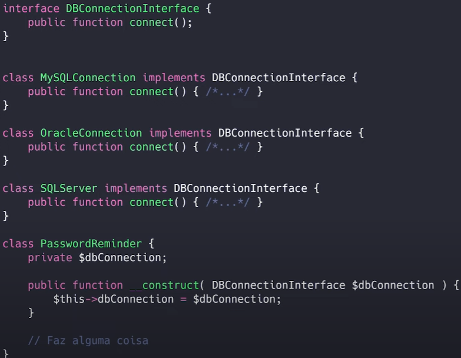

## S.O.L.I.D

- Baseado em: https://medium.com/backticks-tildes/the-s-o-l-i-d-principles-in-pictures-b34ce2f1e898

### S - Single-responsability Principle

  - Para cada responsabilidade do sistema, ter uma entidade que saiba fazer apenas aquilo;

  

  - Com isso podemos:
    - Reaproveitar o código;
    - Refatoriar;
    - Testes automatizados;
    - Menos bugs;
  
  - Tente colocar no nome da função / componente, tudo que ele faz.
    - Se o nome ficar grande demais, ex: function registrationAndEmailConfirmationAndAuthentication () {...}, talvez essa entidade tenha responsabilidades demais.

  #### Forma errada:

  

  #### Forma certa:

  

### O - Open-closed principle

  - Classes, entidades ou funções devem está **abertas** para extensão e **fechadas** para modificação

  

  - A ./assets/imagem errada, representa o caso de que para qualquer novo requesito que o sistema receba, você precisa modificar a entidade, ou para cada situação que ela encontre, precisa mudar seu comportamento interno com um if. Ou seja, toda vez que entra uma requisição, você modifica o interior, com mais um if.
  
  #### Forma errada

  Exemplo:

  - Você tem uma abstração que processa pagamentos, e recebe um objeto de cartão que válida alguns campos:
  ```
  ProcessaPagamentos(cartao)
    cartao.numero?
    cartao.vencimento?
    cartao.nome?
    antifraude(cartao)
    cobrar(cartao)
  ```
  - Pronto, você fez então ela funcionar para processar pagamentos com cartão de crédito.
  - Agora, ela precisa processar os requisitos com o cartão de débito -> até então, ótimo, pois o cartão de débito funcionará da mesma forma.
  - Mas então, agora precisa processar boletos, que possui campos totalmente diferentes, e para resolver de forma rápida, você quebra o Open-closed principle, e faz o seguinte:
   ```
  ProcessaPagamentos(objeto)
    if(objeto.tipo == boleto)
      objeto.codigoDeBarras?
    else
      objeto.numero?
      objeto.vencimento?
      objeto.nome?
      antifraude(objeto)
    cobrar(objeto) 
  ```
  - Agora, toda vez que surgir uma nova forma de pagamentos, você terá que alterar novamente, implementando vários if.

  #### Como resolver isso ?

  - Usando o nível de abstração correto, a abstração base de ProcessaPagamentos, não deveria saber os campos especificos de cada produto financeiro para validar. Podemos, fazer então, o seguinte:
  ```
  ProcessaPagamentos(instrumento)
    instrumento.valido?
    instrumento.cobrar!
  ```
 - Exemplo prática: Um navegador está aberto para extender e adicionar novas funcionalidades, mas a base dele (binário), está fechado.
 - Logo, se quiser que a classe desempenhe mais funções, a abordagem ideal é acrescentar às funções que já existem e NÃO alterá-las.

 #### Outro exemplo

 ##### Forma errada

 

 - Se for preciso trabalhar com PJ, por exemplo, precisariamos alterar a classe, e isso quebra o principio.

 ##### Forma certa


### L — Liskov Substitution

- Se temos uma classe, e criarmos uma subclasse usando a herança. O resultante (objeto) dessa subclasse, deve poder substituir o objeto da classe principal (sem quebrar o programa)


 - Quando uma classe filha não pode executar as mesmas acções que a sua classe pai, isto pode causar bugs.

 - Se tivermos uma classe e criarmos outra classe a partir dela, ela torna-se um pai e a nova classe torna-se um filho. A classe filha deve ser capaz de fazer tudo o que a classe pai pode fazer. Este processo chama-se Herança.

 - A classe filha deve ser capaz de processar os mesmos pedidos e entregar o mesmo resultado que a classe pai ou pode entregar um resultado do mesmo tipo.

 - A ./assets/imagem mostra que a classe-mãe fornece café (pode ser qualquer tipo de café). É aceitável que a classe filha entregue Cappucino porque é um tipo específico de café, mas NÃO é aceitável entregar Água.

 - Se a classe filha não cumprir estes requisitos, significa que a classe filha foi completamente alterada e viola este princípio.

 - Este princípio tem como objetivo impor a consistência, para que a classe-mãe ou a classe-filha possam ser utilizadas da mesma forma sem quaisquer erros.

 - A classe base, precisa ser a mais simples e geral possível, para que uma classe herdeira não quebre. Como a solução dada para o ProcessaPagamentos.

### I — Interface Segregation

- As classes não devem ser forçadas a depender de métodos que não usam;


- Quando uma classe é obrigada a executar acções que não são úteis, é um desperdício e pode produzir erros inesperados se a classe não tiver a capacidade de executar essas acções.

- Uma classe deve executar apenas as acções necessárias para cumprir a sua função. Qualquer outra ação deve ser completamente removida ou transferida para outro local, caso possa ser utilizada por outra classe no futuro.

- Este princípio visa dividir um conjunto de acções em conjuntos mais pequenos, de modo a que uma classe execute APENAS o conjunto de acções de que necessita.

#### Forma errada


#### Forma certa


### D — Dependency Inversion

- Um módulo não deve depender de detalhes de implementação de outro módulo diretamente. Deve existir uma abstração no meio, uma interface por exemplo.


- Em primeiro lugar, vamos definir os termos utilizados aqui de forma mais simples

- Módulo (ou classe) de alto nível: Classe que executa uma ação com uma ferramenta.

- Módulo (ou classe) de baixo nível: A ferramenta que é necessária para executar a ação

- Abstração: Representa uma interface que liga as duas Classes.

- Detalhes: Como a ferramenta funciona

- Este princípio diz que uma Classe não deve ser fundida com a ferramenta que utiliza para executar uma ação. Em vez disso, ela deve ser fundida com a interface que permitirá que a ferramenta se conecte à Classe.

- Também diz que tanto a classe quanto a interface não devem saber como a ferramenta funciona. No entanto, a ferramenta precisa de cumprir a especificação da interface.

- Este princípio tem como objetivo reduzir a dependência de uma classe de alto nível em relação a uma classe de baixo nível através da introdução de uma interface.

- Utilizando a interface, o robo nesse exempo, poderá cortar a pizza com qualquer ferramenta que for dada a ele.

#### Forma errada:


- Dessa forma, temos um alto acoplamento, onde a classe PasswordReminder precisa criar uma instância da classe MySQLConnection, se fossemos usar em outro sistema, teriamos que levar a classe MySQLConnection, junto.

#### Forma certa:



- Dessa forma, a classe PasswordReminder não tem a minima ideia do banco de dados que iremos usar, e agora as classes estão desacopladas.